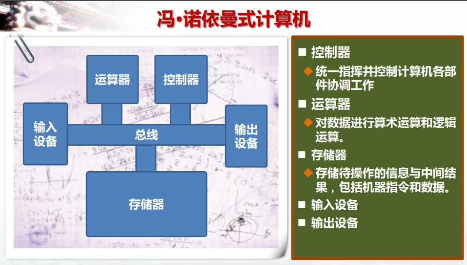
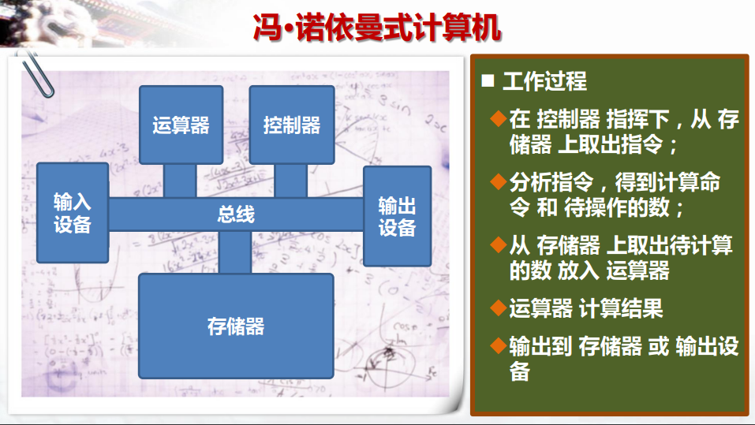

# 冯诺依曼式计算机
也称冯诺依曼结构体

## 冯诺依曼式计算机的组成逻辑结构

## 冯诺依曼式计算机的工作流程

控制器分为三个部分：命令记录员，命令解释器，电信号控制器。
运算器分为两个部分：计算机电路也是ALU运算逻辑单元电路，存储器。

### 运行步骤step
1.命令记录员负责从内存中提取命令
2.命令解释器是通过预设的指令集解释成电信号，电信号也就是控制信号
3.电信号控制器是依据电信号和控制逻辑电路，排列连接组合ALU进行计算任务
4.ALU运行响应的运算逻辑电路
5.将运算后的结果存放到存储器
6.完成全部计算后存储器的结果回写到内存中
7.内存结果显示打印或回写到外存中持久化保存
end.不断的循环上面图表中的流程直至完成计算任务。

## 总结
cpu包含控制器和运算的集成电路
